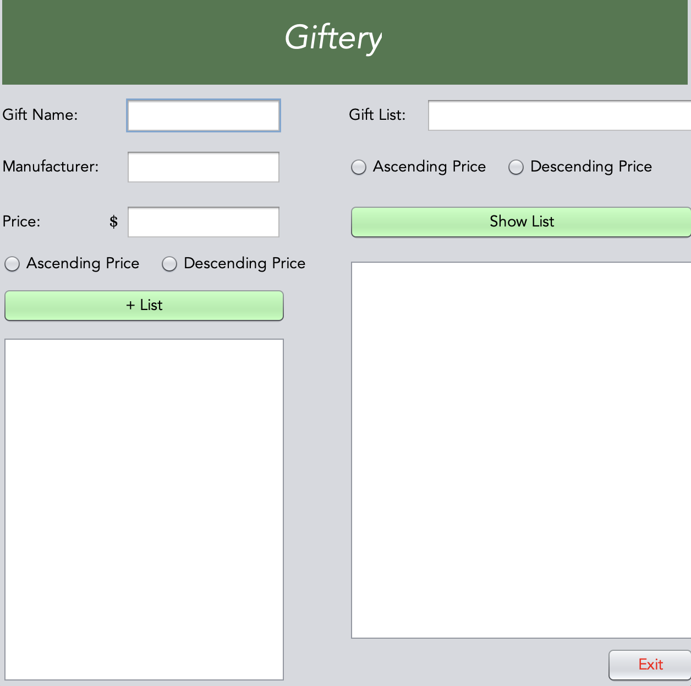

# Giftery

A gift-list manager built with Java Swing. Add gifts, sort them by price, and save or load lists from text files.

## About

Giftery began in June 2023 as a Java prototype for a gift-tracking app idea. I later expanded the concept into a full app pitch, presented to a panel at the end of my high school co-op program. Only this Java prototype was built; the pitched app was a concept. It would've been an app where you could share lists for yourself with friends and family or others. You could add links/images of the gifts to your list, and when you share it with friends, you wouldn't see what people have gotten or "checked off" for you.

## Features

- Add gifts with name, manufacturer, and price, with input validation
- Sort by ascending or descending price
- Saves your list to `CreateList.txt`
- Loads and sorts a list from `Read From List.txt` (one gift per line: `name, manufacturer, price`)

## How to run

Requires Java 8 or newer and Apache NetBeans (built and tested with JDK 25).

1. Clone the repo: `git clone https://github.com/YOUR-USERNAME/giftery.git`
2. In NetBeans, choose File → Open Project and select the folder.
3. Run the project (F6). Files are read from and saved to the project folder.

## Version history

- **v1.0**: Original version, June 2023
- **v1.1**: Fixed file saving, sort options, price and name validation, and file loading; added README

## Author

Jesse Jones
